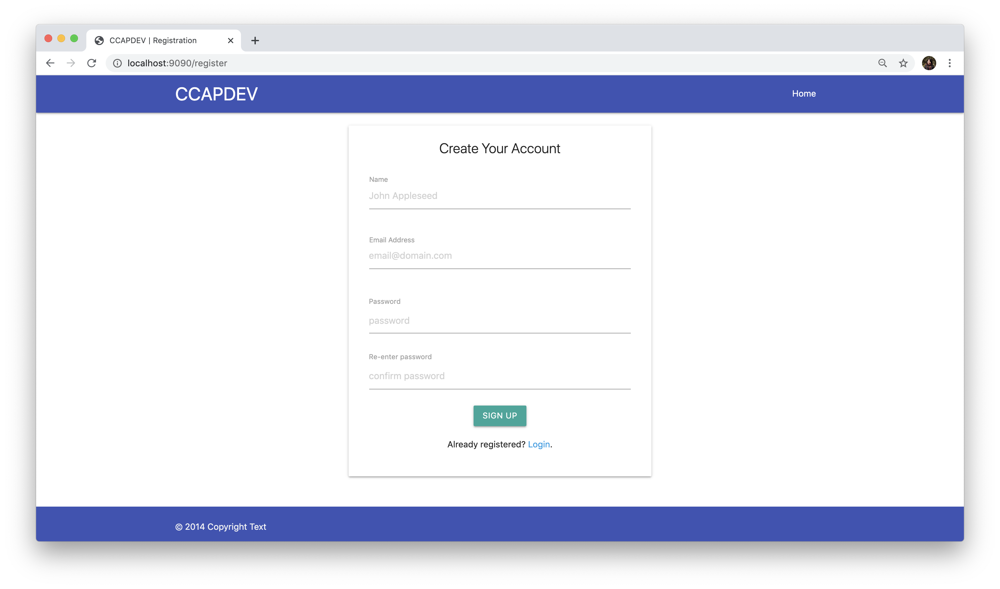

# Register + Login Application using `express-session`
This is a starter code for building a simple user authenctication gateway for an application. The code is structured according to the MVC framework.

## Learning Objectives
At the end of this tutorial, you should be able to do the following:
1. **Server-side validation** using `express-validator`
2. **Hashing** plain text information like passwords using `bcrypt`
3. **Manage sessions** through the use of `express-session` and `connect-mongo` for the storage in a MongoDB database
4. **Error handling** and **redirection** for unauthenticated users (with the help of flash messages using `connect-flash`)

## Prerequisites
This tutorial assumes you already have pre-existing knowledge on the following libraries:
1. [Express.js](https://expressjs.com/)
2. [MongoDB](https://www.mongodb.com/) + [mongoose](https://mongoosejs.com/)
3. Handlebars (specifically [`express-handlebars`](https://github.com/express-handlebars/express-handlebars))

## Software Dependencies
* [NodeJS & npm](https://www.npmjs.com/get-npm)
* [MongoDB Community Edition](https://docs.mongodb.com/manual/administration/install-community/) or [MongoDB Atlas](https://www.mongodb.com/cloud/atlas) Cluster
* Any text editor for JavaScript, HTML & CSS (VSCode, Atom, SublimeText, etc.)

## Local Setup
1. Fork this repository to create a copy on your GitHub account.
2. Clone the forked repository to your machine.
  ```shell
  git clone https://github.com/YOUR_USERNAME/node-login-starter.git
  ```
3. Navigate to the directory.
  ```shell
  cd node-login-starter
  ```
4. Install the dependencies in package.json. All needed packages are already included.
  ```shell
  npm install
  ```
5. Run the server using the script defined (using `nodemon`)
  ```shell
  npm run dev
  ```
6. Navigate to [http://localhost:9090/register](http://localhost:9090/register). You should see the registration page.
  

#### Note
The application currently does not do anything yet except redirect to the next routes on the assumption that input is valid. Test out the navigation by clicking the **buttons** and the **links**.

## Tutorial Proper
Since this is quite complex and there are three main aspects to authentication, instructions for each component will be separated to individual files. It will be listed in [`INSTRUCTIONS.md`](INSTRUCTIONS.md).

#### How to use Markdown (`.md`) files
Markdown is a markup language with wherein you can type things in plain-text but with the right rendering app, it will automatically style the text for you. Kindly open the [`INSTRUCTIONS.md`](INSTRUCTIONS.md) and all other `.md` files in GitHub or use a Markdown Preview extension with your text editor:
* [Visual Studio Code](https://code.visualstudio.com/docs/languages/markdown) - Already included, simply toggle the preview
* [Atom](https://atom.io/packages/markdown-preview) - Package for installation
* [Brackets](http://blog.brackets.io/2013/04/23/markdown-extension-for-brackets/?lang=en) - Package for installation
* [SublimeText](https://packagecontrol.io/packages/MarkdownPreview) - Package for installation
