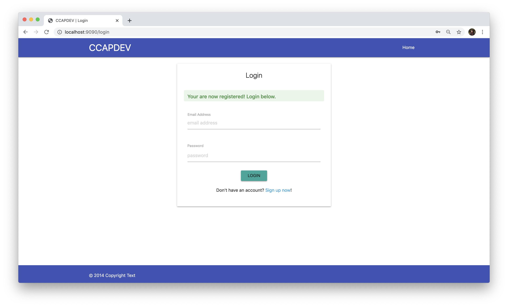
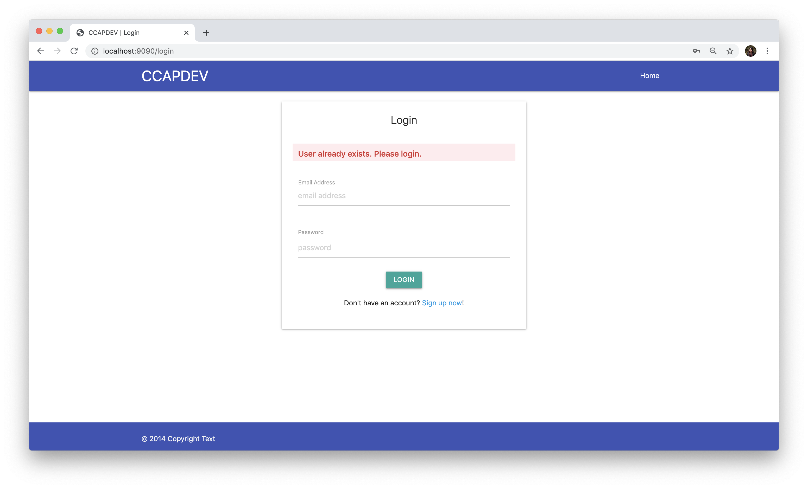

# Registration
_**DISCLAIMER!** This going to quite long._

To complete the functionality of the registration page, first take a look at the form in [`views/register.hbs`](../views/register.hbs) to check what the name of the input fields are. The form is also already set up to send a `POST` request to the route `/register`.

```HTML
<form class="col s8 offset-s2 card" action="/register" method="POST">
  ...
</form>
```

The endpoint `app.post('/register')` is already set up in [`routes/auth.js`](../routes/auth.js).

```JavaScript
router.post('/register', userController.registerUser);
```

What we need to complete is the functionality in the [`controllers/userController.js`](../controllers/userController.js). The comments already explain what needs to be done in the file, but we'll break it down step by step.

```JavaScript
exports.registerUser = (req, res) => {
  // 1. Validate request

  // 2. If VALID, find if email exists in users
  //      NEW USER (no results retrieved)
  //        a. Hash password
  //        b. Create user
  //        c. Redirect to login page
  //      EXISTING USER (match retrieved)
  //        a. Redirect user to login page with error message.

  // 3. If INVALID, redirect to register page with errors
  res.redirect('/login');
};
```

### Validate the Request
In this example, we'll using `express-validator` to help us set up validation rules and custom error messages. The validator is a middleware that needs to be executed before the route callback.

From the [`express-validator` docs](https://express-validator.github.io/docs/index.html):
> ```JavaScript
[
  // username must be an email
  check('username').isEmail(),
  // password must be at least 5 chars long
  check('password').isLength({ min: 5 })
]
```

The validator is required to be in an array. So let's define one for our registration form the [`validators.js`](../validators.js) file. This is where we'll keep all the validation rules for the forms.

```JavaScript
const { body } = require('express-validator');

const registerValidation = [
  // Name should not be empty
  body('name').not().isEmpty().withMessage("Name is required."),

  // Email should not be empty and must be a valid email
  body('email').not().isEmpty().withMessage("Email is required.")
    .isEmail().withMessage("Please provide a valid email."),

  // Password needs to be min 6 chars
  body('password').isLength({ min: 6 }).withMessage("Password must be at least 6 characters long."),

  // Confirm Password needs to be min 6 chars AND must match the req.body.password field
  body('confirmPass').isLength({ min: 6 }).withMessage("Password must be at least 6 characters long.")
    .custom((value, { req }) => {
      if (value !== req.body.password) {
        throw new Error("Passwords must match.");
      }
      return true;
    })
];

module.exports = { registerValidation };
```

In the above block, we import only the [`body`](https://express-validator.github.io/docs/check-api.html#bodyfields-message) function from `express-validator` to check only the `req.body`.

The validation rules are a series of chained validation functions. For each rule, you can set a customized error message using the function `withMessage()`.

For the `confirmPass` field, since we're separating the validation rule object from the route definition, we don't have direct access to the `req` object to get the value of `req.body.password`. So the solution is to [create a custom validator](https://express-validator.github.io/docs/custom-validators-sanitizers.html).

Lastly, we make sure to export this `registerValidation` object through the `module.exports`.

---

Now that we have the validator, we need to add this to [`routes/auth.js`](../routes/auth.js):
```JavaScript
const { registerValidation } = require('../validators.js');

router.post('/register', registerValidation, userController.registerUser);
```

The first line simply imports the array object to the router and we add it as a parameter in the route definition so that it will run the validations first and return the `errors` object.

---

Back to [`controllers/userController.js`](../controllers/userController.js), we can now slowly complete the todo list.

We need to also use `express-validator` here to be able to get the `errors` object so let's import that first in the controller.
```JavaScript
const { validationResult } = require('express-validator');
```

In the `registerUser` function, remove the `res.redirect('/login')` line and replace it with the next block of code:
```JavaScript
const errors = validationResult(req);

if (errors.isEmpty()) {
  const { name, email, password } = req.body;

  // Next items go here...
  // This line can be deleted in the next step.
  // Adding it so that the error validation can be tested.
  res.redirect('/login');
} else {
  const messages = errors.array().map((item) => item.msg);

  req.flash('error_msg', messages.join(' '));
  res.redirect('/register');
}
```
`const errors = validationResult(req);` retrieves the result from `express-validator`. It's an array of objects with the error messages and the specific fields.

This `if-else` block simply checks if there were errors returned. If the `errors` array is empty, that means there were no validation error and we can continue with the next step.

If there are errors, we retrieve the `msg` attribute of each error object and we attach this to the `req.flash('error_msg')` object that we configured in the server. This sends the error messages we have from the validation to the view — which in this case will be the `register.hbs` since we're telling the response to redirect to `/register`.

#### Testing
We're done with **#1** and **#3** in the `registerUser` list of `TODO`. To check if it's working so far, do the following:
1. Entering values that would cause the form to be invalid to see the error messages on the register page.
2. Enter valid values to pass form validation to be redirected to the login page.

### Check User in Database
So the next step is to check if the User/email exists in the database. If it doesn't exist, we can proceed with creating the user, but if it does exist, we need to redirect them to the login page with an error message.

Replace the `res.redirect('/login');` that we had from the previous step with the following code:
```JavaScript
userModel.getOne({ email: email }, (err, result) => {
  if (result) {
    console.log(result);
    // found a match, return to login with error
    req.flash('error_msg', 'User already exists. Please login.');
    res.redirect('/login');
  } else {
    // no match, create user (next step)
    // for now we redirect to the login with no error.
    res.redirect('/login');
  }
});
```

We're using the `userModel`'s `getOne()` function to retrieve the first user that matches the email address we have from the request body. If a match is found, meaning the `result` parameter is not `null` or `undefined`, we send an error message again using `req.flash('error_msg')` and redirect them to the `/login` page so they can login instead of registering.

Otherwise (`else`), we can proceed with doing the necessary preprocessing to create the user in the database. For now, it will redirect to the `/login` page again.

#### Testing
We can't test this yet since we don't have data in the database at this point... We'll test it together with the create user.

### Creating the User
Alright, almost done! Last thing to handle is creating the user if there's no existing user with the given email yet.

Let's import `bcrypt` so we can use this to hash the password.
```JavaScript
const bcrypt = require('bcrypt');
```

Next, replace the `res.redirect('/login')` line in the **`else`** from the previous step with this:
```JavaScript
const saltRounds = 10;

// Hash password
bcrypt.hash(password, saltRounds, (err, hashed) => {
  const newUser = {
    name,
    email,
    password: hashed
  };

  userModel.create(newUser, (err, user) => {
    if (err) {
      req.flash('error_msg', 'Could not create user. Please try again.');
      res.redirect('/register');
      // res.status(500).send({ message: "Could not create user"});
    } else {
      req.flash('success_msg', 'Your are now registered! Login below.');
      res.redirect('/login');
    }
  });
});
```

There are two things happening here. First, we used `bcrypt` to hash the `password` from the request and we also passed this variable called `saltRounds` which has the value of 10. `bcrypt` is in charge of making the password undecipherable to the naked eye. **10** is the default value that `bcrypt` recommends that is secure enough but not too computationally heavy. `bcrypt` returns the hashed password through the callback (since it's asynchronous too).

So in the callback, we can now create our `User` object with the name, email and password. The values of the name and email are as is from the request, but for the password, we need to use the value from `bcrypt`.

Then, we simply call the `create()` method of the `userModel` we've defined to insert the record in the database. Notice here that the error handling for any database error is here. (`if(err) ...`). We do this so that we can use `flash` again to send an error message that something went wrong. So we redirect back to the `/register` page with an error message.

But if it's successful, we now send a `success_msg` through `req.flash()` and redirect the user to the `/login` page.

#### Testing
That's it, we're done with all the code for registration!!! To test it out register first with valid values and you should now be navigated to the login page with a success message.



You can use MongoDB Compass or if you changed to MongoDB Atlas to check if the user has been saved. Alternatively, to test the negative use case, click the _Sign up now_ link at the bottom and try to register again with the same email and you should be redirected to the login page with an error message.



### Next: [`03-LOGIN`](03-LOGIN.md)
