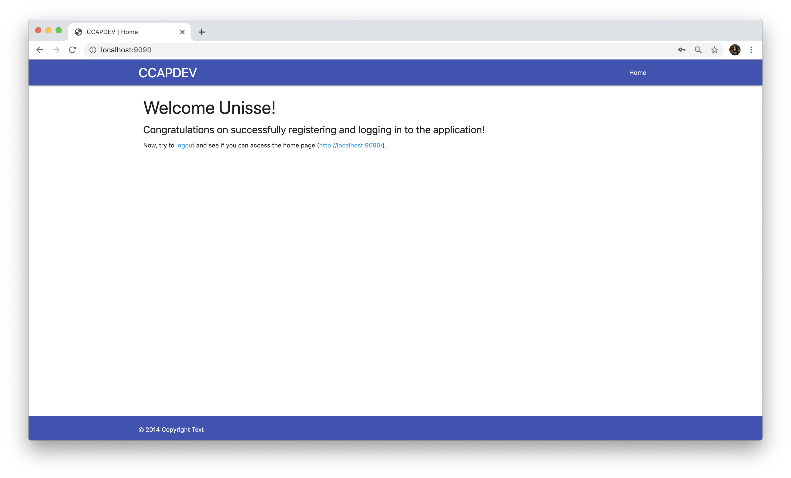

# Log In and Sessions
_**DISCLAIMER!** This going to quite long. But it's pretty similar from the registration, so it would be somewhat faster..._

To complete the functionality of the login page, first take a look at the form in [`views/login.hbs`](../views/login.hbs) to check what the name of the input fields are. The form is also already set up to send a `POST` request to the route `/login`.

```HTML
<form class="col s8 offset-s2 card" action="/login" method="POST">
  ...
</form>
```

The endpoint `app.post('/login')` is already set up in [`routes/auth.js`](../routes/auth.js).

```JavaScript
router.post('/login', userController.loginUser);
```

What we need to complete is the functionality in the [`controllers/userController.js`](../controllers/userController.js). The comments already explain what needs to be done in the file, but we'll break it down step by step.

```JavaScript
exports.loginUser = (req, res) => {
  // 1. Validate request

  // 2. If VALID, find if email exists in users
  //      EXISTING USER (match retrieved)
  //        a. Check if password matches hashed password in database
  //        b. If MATCH, save info to session and redirect to home
  //        c. If NOT equal, redirect to login page with error
  //      UNREGISTERED USER (no results retrieved)
  //        a. Redirect to login page with error message

  // 3. If INVALID, redirect to login page with errors
  res.redirect('/');
};
```

### Validate the Request
We'll use the same method to validate the login form but since there are different fields, we need to define a new array for the login form in [`validators.js`](../validators.js).

```JavaScript
const loginValidation = [
  // Email should not be empty and must be a valid email
  body('email').not().isEmpty().withMessage("Email is required.")
    .isEmail().withMessage("Please provide a valid email."),
  // Password should not be empty and needs to be min 6 chars
  body('password').not().isEmpty().withMessage("Password is required.")
];

// update exports
module.exports = { registerValidation, loginValidation };
```
---
Now that we have the validator, we need to add this to [`routes/auth.js`](../routes/auth.js):
```JavaScript
// Update the import to include the new loginValidation
const { registerValidation, loginValidation } = require('../validators.js');

router.post('/login', loginValidation, userController.loginUser);
```
---
Back in [`controllers/userController.js`](../controllers/userController.js), in the `loginUser` function, remove the `res.redirect('/')` line and replace it with the next block of code:
```JavaScript
const errors = validationResult(req);

if (errors.isEmpty()) {
  const {
    email,
    password
  } = req.body;

  // Next items go here... Same as before, this will be replaced.
  res.redirect('/');
} else {
  const messages = errors.array().map((item) => item.msg);

  req.flash('error_msg', messages.join(' '));
  res.redirect('/login');
}
```

This block is exactly the same as it was in registration except we're now redirecting to the main page `'/'` which should show them the main content of the application.

#### Testing
We're done with **#1** and **#3** in the `loginUser` list of `TODO`. To check if it's working so far, do the following:
1. Leave the password blank and submit, it should take you back to the login form with an error message.
2. Enter valid values to pass form validation (does not have to be the same user, just enter valid values) to be taken to the home page.

### Find User in Database
We need to check if the user exists in the database to continue with the authentication process. Let's find if the email matches a record in the database first.

Replace `res.redirect('/');` from above and add the following:
```JavaScript
userModel.getOne({ email: email }, (err, user) => {
  if (err) {
    // Database error occurred...
    req.flash('error_msg', 'Something happened! Please try again.');
    res.redirect('/login');
  } else {
    // Successful query
    if (user) {
      // User found!

      // next block of code goes here
      res.redirect('/');
    } else {
      // No user found
      req.flash('error_msg', 'No registered user with that email. Please register.');
      res.redirect('/register');
    }
  }
});
```

Using the same function from the `userModel`, we try to search for the email in the collection. If a user is found, we'll do more validations before we add the user.

But if the email does not match any record in the database, then we redirect them back to the registration page with an error.

#### Testing
Check if the negative test case will pass by logging in with a different email from the one you registered. You should see the screen below:


### Authenticate User
Now that we've found an email match for the user trying to login, we need to authenticate if the user is real or someone guessing the password.

We use `bcrypt` again here to check the hashed password stored in the database against the password the user entered. `bcrypt` has a function called `compare(hash, plaintext, callback)`. Replace the `res.redirect('/');` with this block:

```JavaScript
// Check password with hashed value in the database
bcrypt.compare(password, user.password, (err, result) => {
  // passwords match (result == true)
  if (result) {
    // Update session object once matched!
    req.session.user = user._id;
    req.session.name = user.name;

    console.log(req.session);

    res.redirect('/');
  } else {
    // passwords don't match
    req.flash('error_msg', 'Incorrect password. Please try again.');
    res.redirect('/login');
  }
});
```

`bcrypt.compare()` returns `true` when the passwords match and `false` otherwise. If the passwords don't match, we use `flash` again to send the error message and redirect them back to the login page to try again.

But if it matches, we can now update the session with the user's information. Normally, you just attach some ID to represent the user. The values you attach to `req.session` can be name. But here, we're using `user` for easy identification.

Once we've added the user details in the session, we can use this in any subsequent routes by accessing the `req.session.user` field. We also added a `name` field because in [`routes/index.js`](routes/index.js), we declared that the name will be used for the greeting:
```JavaScript
router.get('/', (req, res) => {
  res.render('home', { pageTitle: 'Home', name: req.session.name } );
});
```

#### Testing
Let's now test the login and see if the user's name will show on the home page... Log in with the credentials that you entered in registration. Upon successful login, you should see the main page with a "Welcome" message!



### Protecting Private Routes (and vice versa)
Login is complete but we're not quite done yet... Change the URL in the address bar to [http://localhost:9090/register](http://localhost:9090/register). You can still access it! But you're supposed to be logged on... so you're not supposed to see the registration page anymore!

Since we already have the session information, we can use that to check if a session is existing and then redirect the user to the right page. To achieve that, we can write middleware functions to check the session object.

Place this code in [`middlewares/checkAuth.js`](../middlewares/checkAuth.js).

```Javascript
exports.isPrivate = (req, res, next) => {
  // Must be authenticated to go to the next function
  if (req.session.user) {
    return next()
  } else {
    res.redirect('/login');
  }
};

exports.isPublic = (req, res, next) => {
  // If authenticated, go to home page
  if (req.session.user) {
    res.redirect('/');
  } else {
    return next();
  }
}
```

The first function `isPrivate` is the middleware we need to use for the private routes. The second function `isPublic` is for the public routes that authenticated users should not go back to.

To use these functions, we need to update the [`routes/auth.js`](../routes/auth.js).
```JavaScript
const { isPublic, isPrivate } = require('../middlewares/checkAuth');

router.get('/login', isPublic, (req, res) => {
  res.render('login', {
    pageTitle: 'Login',
  });
});

router.get('/register', isPublic, (req, res) => {
  res.render('register', {
    pageTitle: 'Registration',
  });
});

router.post('/register', isPublic, registerValidation, userController.registerUser);
router.post('/login', isPublic, loginValidation, userController.loginUser);
router.get('/logout', isPrivate, userController.logoutUser);
```

Also update [`routes/index.js`](../routes/index.js):
```JavaScript
const { isPrivate } = require('../middlewares/checkAuth');

router.get('/', isPrivate, (req, res) => {
  res.render('home', { pageTitle: 'Home', name: req.session.name } );
});
```

As mentioned before, middlewares are functions that run before the controller callback, so it stops any unnecessary validations.

Since you're still logged on, try accessing [http://localhost:9090/login](http://localhost:9090/login). It should redirect you back to the home page [http://localhost:9090/](http://localhost:9090/).


### Next: [`04-LOGOUT`](04-LOGOUT.md)
